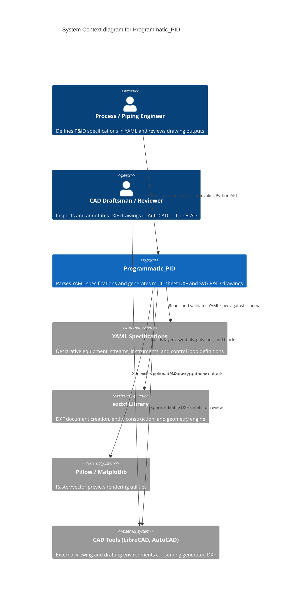

# Architecture Map: Programmatic_PID

Visual and structured map of the system architecture for `Programmatic_PID`,
aligned with the C4 model standard and the maintainable architecture contract.

## 1. System Context (C4Context)

High-level diagram showing users, primary systems, and external output formats.



---

## 2. Container Diagram (C4Container)

Container-level view showing internal package organization, layout managers, and rendering engines.

```mermaid
C4Container
    title Container diagram for Programmatic_PID

    Person(caller, "Caller / CLI User", "Executes generate-pid or imports package modules")

    Container_Boundary(c1, "Programmatic_PID Package")
        Container(cli, "CLI & Facade", "programmatic_pid.generator", "Entrypoint, spec loading, profile overlays, and sheet orchestration")
        Container(validator, "Spec Validator", "programmatic_pid.validator", "Validates YAML spec structure and equipment/stream referential integrity")
        Container(stream_router, "Stream Router", "programmatic_pid.stream_router", "Routes process streams between equipment anchors, manages labels and arrows")
        Container(control_loops, "Control Loops", "programmatic_pid.control_loops", "Renders instrument signal paths and loop identifiers")
        Container(layout_renderer, "Layout & Sheet Rendering", "programmatic_pid.sheet_layout & sheet_rendering", "Arranges title blocks, notes panels, mass balance, and emits DXF/SVG")
        Container(dxf_builder, "DXF Builder Primitives", "programmatic_pid.dxf_*", "Symbols, geometry math, layers, text formatting, and arrow primitives")
    Container_Boundary_End()

    System_Ext(ezdxf_engine, "ezdxf Engine", "Underlying DXF generation library")
    System_Ext(output_files, "Drawing Artifacts", "Local DXF and SVG files in output/")

    Rel(caller, cli, "Executes CLI arguments or calls main()")
    Rel(cli, validator, "Validates loaded specification")
    Rel(cli, layout_renderer, "Orchestrates sheet rendering workflow")
    Rel(layout_renderer, stream_router, "Requests stream routing and labeling")
    Rel(layout_renderer, control_loops, "Requests control signal line generation")
    Rel(layout_renderer, dxf_builder, "Draws equipment symbols, title blocks, and annotations")
    Rel(stream_router, dxf_builder, "Draws arrows, lines, and text collision bounds")
    Rel(control_loops, dxf_builder, "Draws bubble tags and leader lines")
    Rel(dxf_builder, ezdxf_engine, "Creates DXF drawing entities")
    Rel(layout_renderer, output_files, "Saves DXF files and SVG previews")
```

---

## Feature Map

| Capability | Component | Interface | Evidence |
| --- | --- | --- | --- |
| CLI Drawing Orchestration | CLI & Facade | `programmatic_pid.generator:main` | `tests/integration/test_generator.py` |
| YAML Spec Validation | Spec Validator | `programmatic_pid.validator.validate_spec` | `tests/unit/test_validator.py` |
| DXF Construction Primitives | DXF Builder | `programmatic_pid.dxf_builder` | `tests/unit/test_dxf_builder.py` |
| Equipment Geometry & Anchors | DXF Geometry | `programmatic_pid.dxf_geometry.equipment_anchor` | `tests/unit/test_dxf_geometry.py` |
| Equipment Symbols Generation | DXF Symbols | `programmatic_pid.dxf_symbols.draw_equipment_symbol` | `tests/unit/test_dxf_symbols.py` |
| Stream Routing & Arrowheads | Stream Router | `programmatic_pid.stream_router.route_stream` | `tests/unit/test_stream_router.py` |
| Control Loop Leaders & Tags | Control Loops | `programmatic_pid.control_loops.draw_control_loops` | `tests/unit/test_control_loops.py` |
| Sheet Layout & Notes Panels | Sheet Layout | `programmatic_pid.sheet_layout.draw_notes_panel` | `tests/unit/test_sheet_layout.py` |
| Multi-Sheet Drawing & Previews | Sheet Rendering | `programmatic_pid.sheet_rendering.render_sheets` | `tests/integration/test_sheet_rendering.py` |
| Architecture Map Contract Validation | Architecture Validator | `scripts/architecture_map_contract.py` | `tests/scripts/test_architecture_map_contract.py` |

---

## Architecture Change Log

| Date | Issue / PR | Description |
| --- | --- | --- |
| 2026-09-10 | #1610 | Initial C4 architecture map specification (Context, Container, Feature Map, Change Log) per Epic #1594 |
